<!-- ABOUT THE PROJECT -->
 Curve Tracer
 =================

  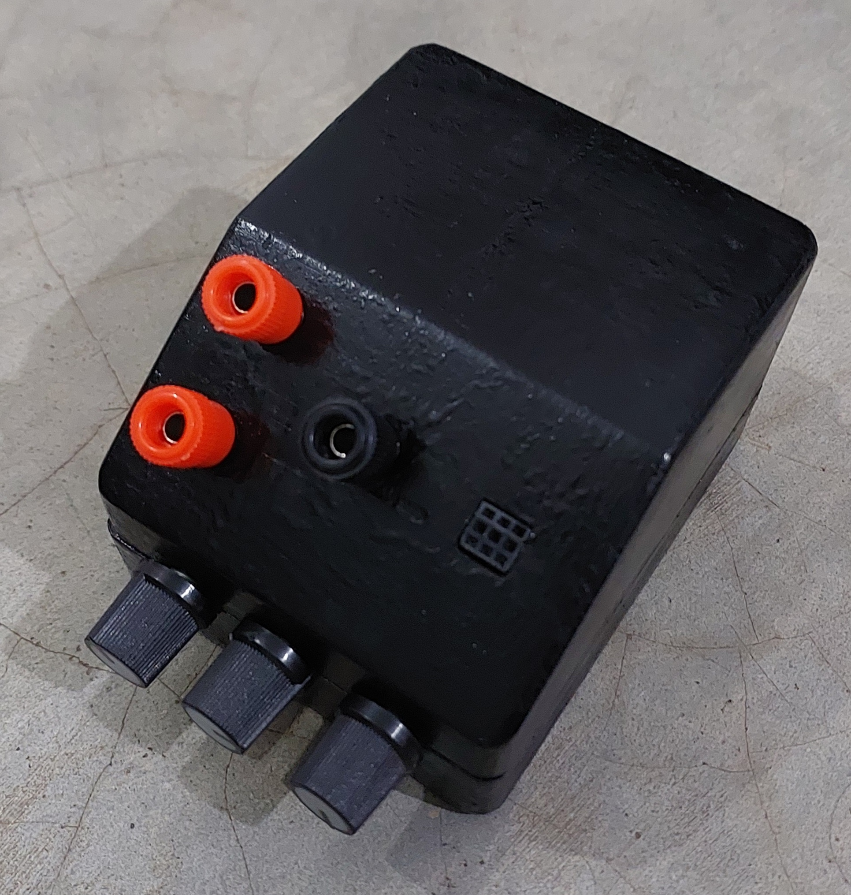
&nbsp; &nbsp; &nbsp; &nbsp;
  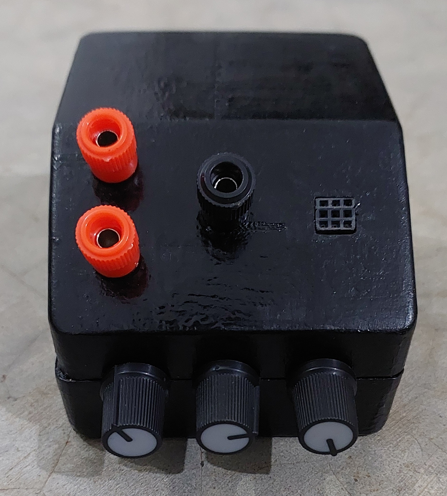
&nbsp; &nbsp; &nbsp; &nbsp;
  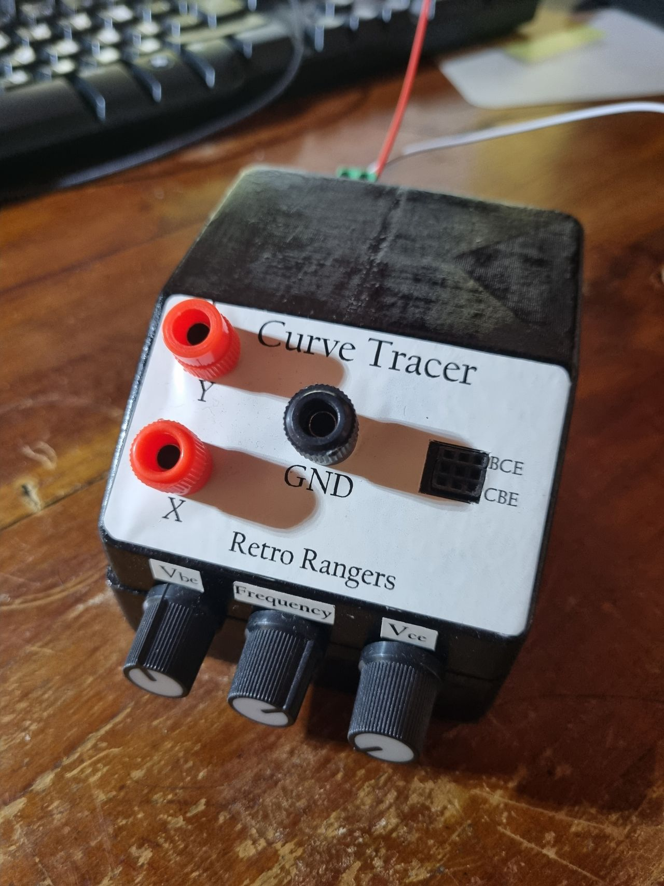

Table of contents
=================

<!--ts-->
   * [Abstract](##Abstract)
   * [Introduction](#Introduction)
   * [Schematic & PCB](#Schematic-&-PCB)
   * [Enclosure](#Enclosure)
   * [Final Outputs](#Final-Outputs)
   * [References](#References)
   * [Contributors](#Contributors)
<!--te-->

## Abstract
This project was undertaken as part of the EN2091 Module, specifically in fulfillment of the "Analog Design Project". The objective of this project was to deepen our foundational understanding of analog electronics and expose us to the challenges within that domain. As per those requirements, we built this device mostly out of analog electronic components such as opamps, diodes and transistors. After referring many sources such as Journals and Videos,
* The initial simulations were made using Proteus and LTspice, then the circuit was transferred to the breadboard for further testing.
* The components were carefully selected according to our needs and by trial and error.
* The PCB was designed in Altium Designer.
* The enclosure was designed in Solid Works.

## Introduction 
Curve Tracer is a device that plots the characteristics curve of an electronic system. This device
mainly focuses on the voltage vs current plot. This device was specifically made to plot the Vce
vs Ic of an NPN transistor for different Ib values in the common emitter configuration. This is achieved by providing a stair step input
to the base terminal while performing a voltage sweep across the Collector-Emitter terminal. This
design can be easily used for two terminal components as well. All we have to do is use the Collector
and Emitter terminals only. Even though we could’ve used a display to plot the output and made
the device portable, we have opted to provide the output to an oscilloscope with X-Y mode. Since
an oscilloscope can provide more functionalities this option will further the capability of our device
and make it more resourceful.

## Schematic & PCB
* The inspiration for our schematic was derived from an article from "The IEE Journal" [[1]](#1) and "W2AEW's Video"[[2]](#2) .

  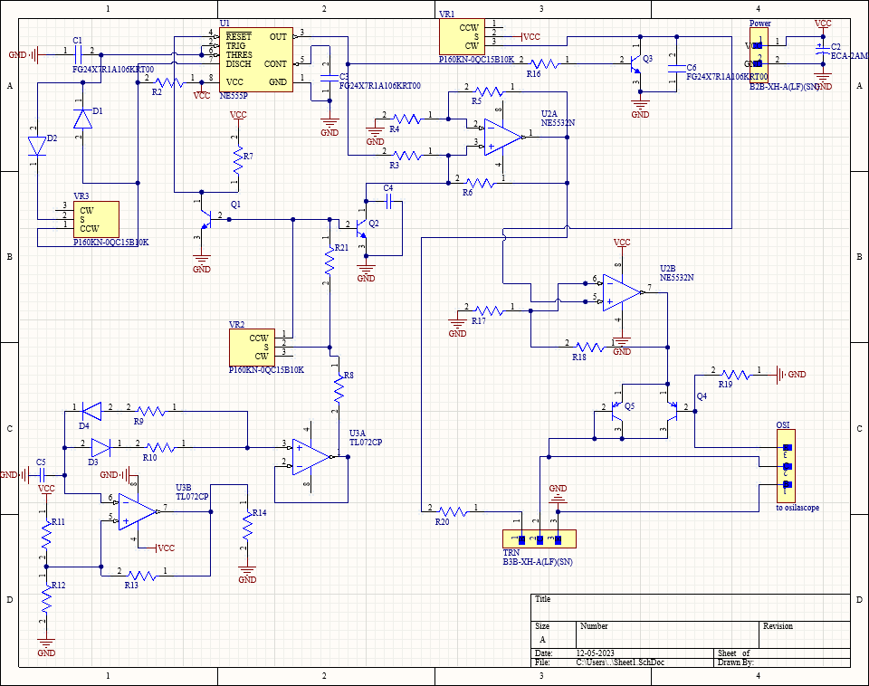

* Components were sourced locally and the pcb was printed abroad.

  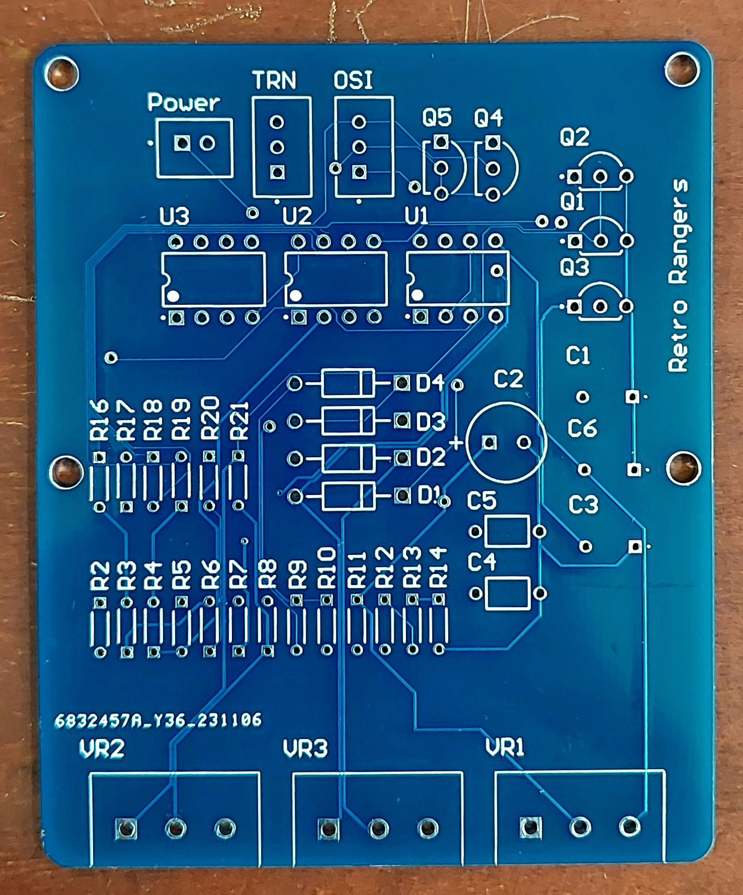
&nbsp; &nbsp; &nbsp; &nbsp;
  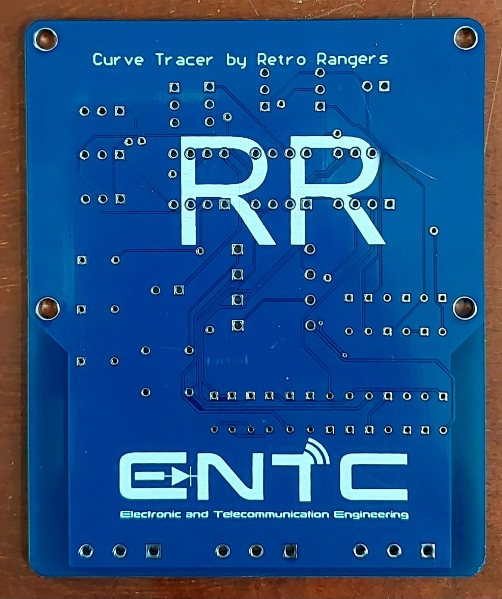
&nbsp; &nbsp; &nbsp; &nbsp;
  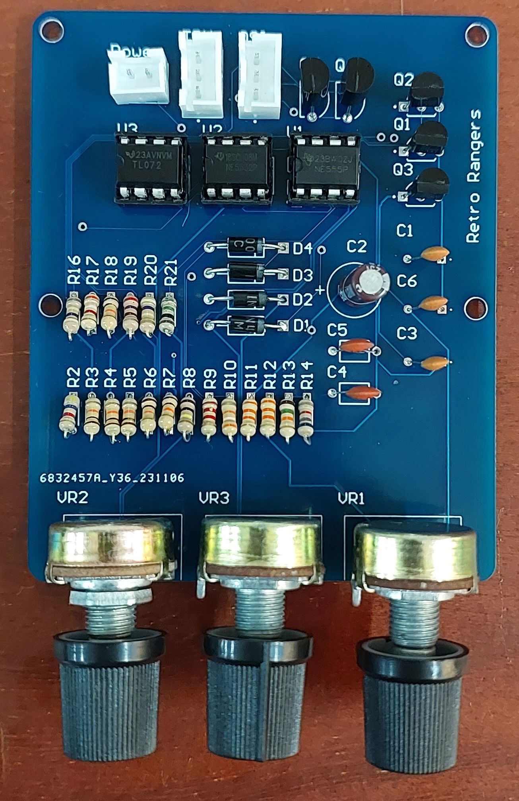

## Enclosure
The enclosure consists of a top and a bottom case which can be connected through screws. The
bottom case houses the pcb, while the top case allows for the placement of various electronic
components. Input to the oscilloscope is given through the holes placed at the top. Three holes are
provided on the front to fine tune the curve. On the back of the case there two holes provided for
the DC power supplu jack and for a on/off button.
* Enclosure was 3D printed, sanded and painted.

  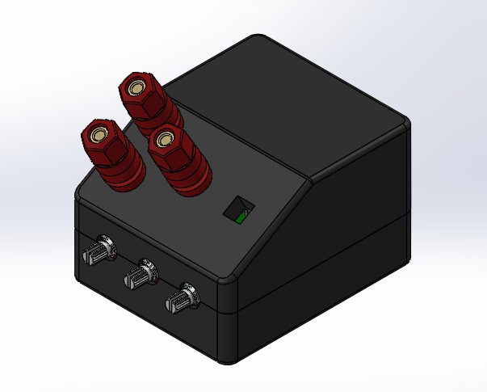
&nbsp; &nbsp; &nbsp; &nbsp;
  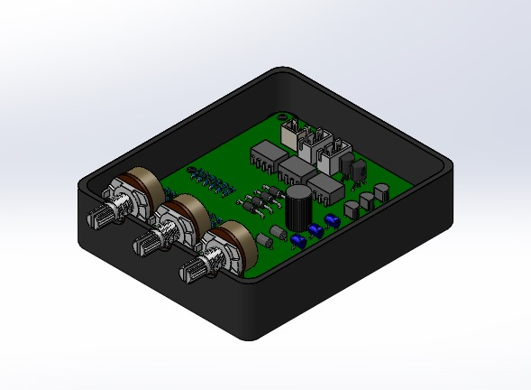

## Final Outputs
* Below is the simulation results of our pcb.

  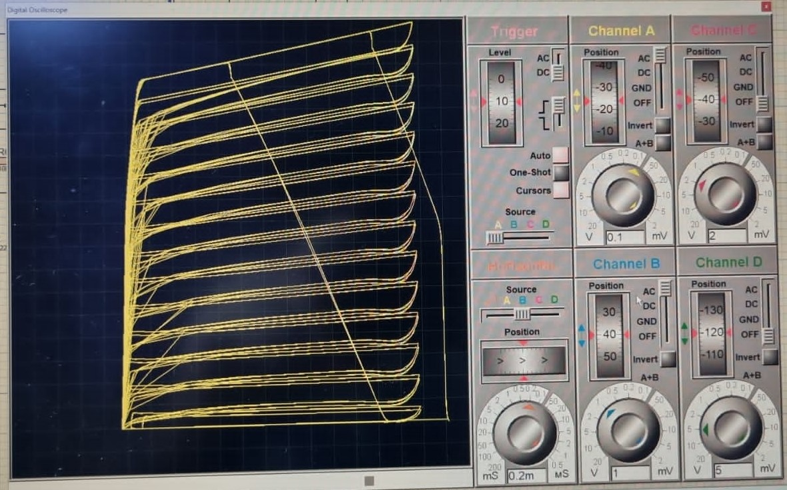

* Output from Digital & Analog Oscilloscopes

  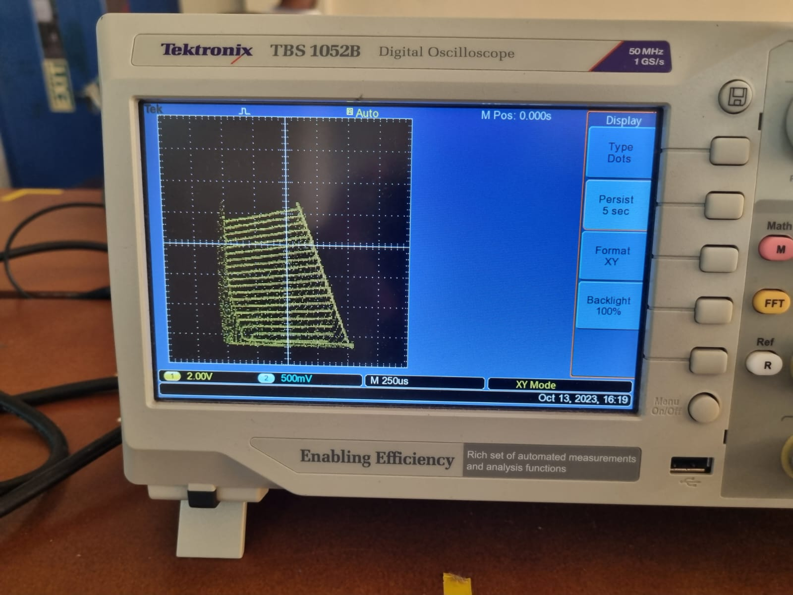
&nbsp; &nbsp; &nbsp; &nbsp;
  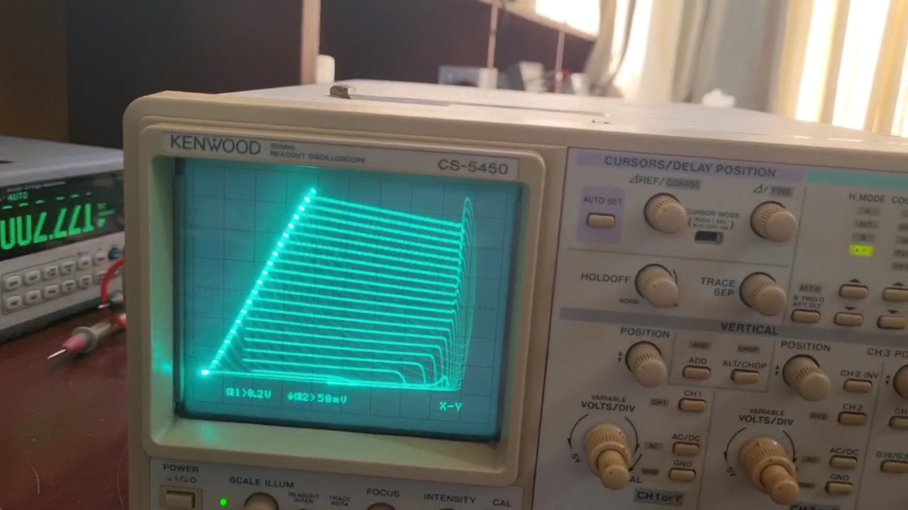

  

## References
<a id="1">[1]</a> 
A. A. Hatzopoulos, “Computer-aided circuit analysis and design projects for electronic engineering
students,” IEE ENGINEERING SCIENCE AND EDUCATION JOURNAL, vol. 8, no. 1,
p. 23, 1999.

<a id="2">[2]</a>
w2aew. (2016) 232: More circuit fun: Simple transistor curve tracer using stairstep generator
circuit. [Online]. Available: https://www.youtube.com/watch?v=ZOLLoa2fH24
<!-- CONTACT -->
## Contributers

* Jazoolee Ahamed - [LinkedIn](https://www.linkedin.com/in/jazoolee-ahamed/)
* Nidula Gunawardana - [LinkedIn](https://www.linkedin.com/in/nidula-gunawardana-22819a1b3/)
* Tharoosha Lakshan - [LinkedIn](https://www.linkedin.com/in/tharoosha-lakshan-4a4194241/)
* Thisara Gunawardana - [LinkedIn](https://www.linkedin.com/in/thisara-gunawardana-3a1774264/)
